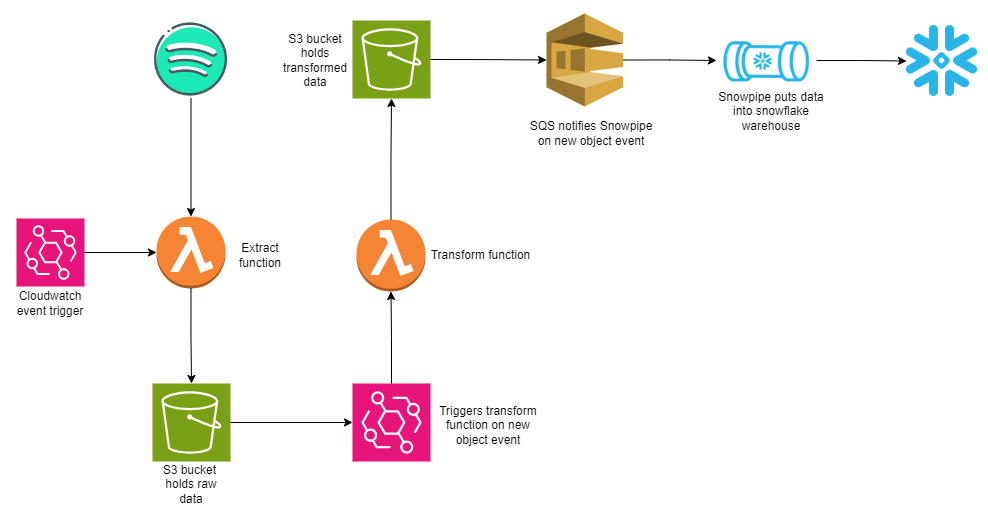

# Spotify Top Songs Global Pipeline

## Overview

This project automates the daily extraction of "Top Songs Global" information from Spotify and stores it in Snowflake using AWS services. The pipeline uses AWS Lambda for serverless computation and AWS S3 for temporary data storage.

## Architecture

## Features

- Daily extraction of Spotify's "Top Songs Global" data
- Serverless execution using AWS Lambda
- Temporary data storage in AWS S3
- Final data storage in Snowflake for analysis

## Prerequisites

- AWS account with access to Lambda and S3
- Spotify Developer account and API credentials
- Snowflake account and connection details

## Setup

1. Create an EventBridge rule to trigger the "extract" Lambda function daily at 10:00 AM.

2. In your S3 bucket, create two folders:
   - "to_processed"
   - "transformed_data"

3. Set up a trigger on the "to_processed" folder in S3 to invoke the "transform" Lambda function when new objects are created.

4. In Snowflake, create a new database and schema for this project.

5. Execute the SQL commands in the `snowflake/sql_worksheet.sql` file one by one in the newly created schema.

6. In the S3 "processed" folder, create three subfolders:
   - "album_data/"
   - "songs_data/"
   - "artist_data/"

7. Create an event trigger in S3 with a notification destination as an SQS queue. The ARN for this queue can be found in the "notification_channel" column of the output from running the "SHOW PIPES;" command (line 74 in the sql_worksheet.sql file).

8. Configure the Lambda functions with necessary environment variables:
   - Spotify API credentials
   - S3 bucket name and folder paths
   - Snowflake connection details

9. Ensure that the Lambda functions have the necessary IAM permissions to access S3, EventBridge, and Snowflake.

10. Test the pipeline by manually triggering the "extract" Lambda function and verifying that data flows through the entire process.

## Usage

The pipeline runs automatically on a daily basis. To manually trigger the pipeline:

1. Go to the AWS Lambda console
2. Find the function for this project
3. Click "Test" to run the function

## Data Flow

1. AWS Lambda function is triggered daily
2. Function calls Spotify API to fetch "Top Songs Global" data
3. Data is temporarily stored in AWS S3
4. Data is then loaded from S3 into Snowflake
5. Temporary data in S3 is deleted

## Acknowledgments

- Spotify for providing the API
- AWS for their serverless computing and storage solutions
- Snowflake for their data warehousing platform